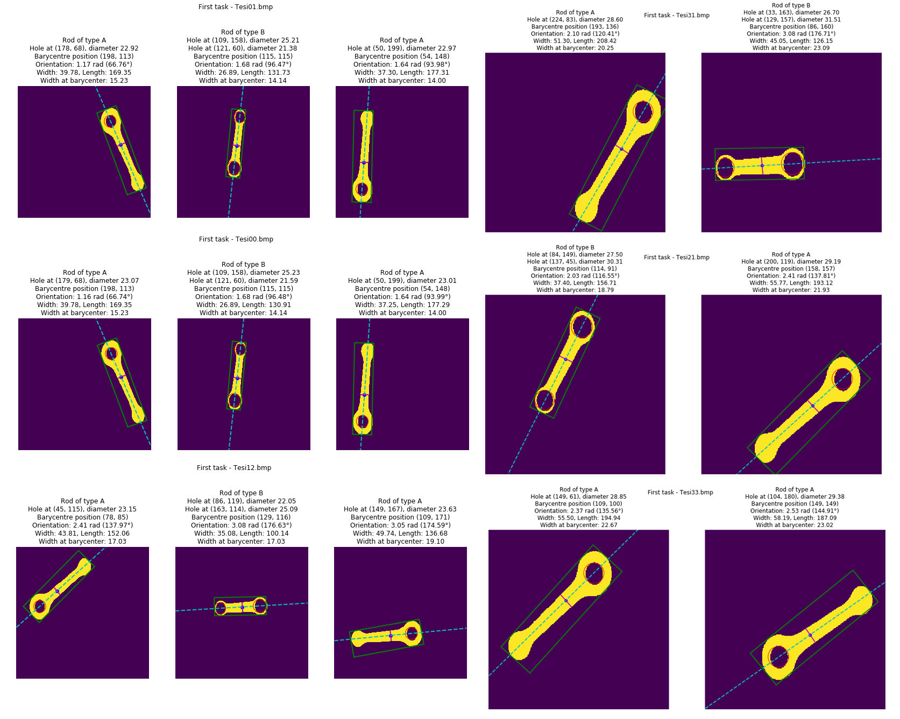

# 🔧 Visual Inspection of Connecting Rods 🔎

This repository contains a project realized as part of the *Project Work in Image Processing and Computer Vision* exam of the [Master's degree in Artificial Intelligence, University of Bologna](https://corsi.unibo.it/2cycle/artificial-intelligence).

## Description
This software system aims at visual inspection of motorcycle connecting rods. The system should be able to analyse the dimensions of two different types of connecting rods to allow a vision-guided robot to pick and sort rods based on their type and dimensions. The two rod types are characterized by a different number of holes: Type A rods have one hole whilst Type B rods have two holes.


## Cloning

First of all, you need to download the repository through cloning.

```sh
git clone https://github.com/gmurro/visual-inspection-rods.git
cd visual-inspection-rods
```

## **1. Prerequisites**

The project has been developed using Jupyter Notebook.
The python interpreter used is `python 3.5.6`.


The easiest way to install the required version, is to use [Anaconda](https://www.anaconda.com/distribution/).
After installing Anaconda, you can create a new environment with the required version of python by running the following command:

```sh
conda create -n visual-inspection-rods python=3.5.6
```

Then, you can activate the environment by running:

```sh
conda activate visual-inspection-rods
```

Finally, you can install the required packages by running:

```sh
pip install -r requirements.txt
```

## **2. Run**
You can run the project by running the following command:

```sh
jupyter notebook
```

Then, you can open the notebook `VisualInspectionMotorcycleConnectingRods.ipynb` and run the cells.

## **3. Results**
The results of the project are reported in the following images.
In order to have a better understanding of the results, you can refer to the report `report.pdf` and the presentation `presentation.pdf`.


## Resources & Libraries

- [OpenCV](https://opencv.org/)
- [NumPy](https://numpy.org/)
- [Matplotlib](https://matplotlib.org/)


## Versioning

We use Git for versioning.


## Author

| Reg No. |   Name    |  Surname  |                 Email                  |                       Username                        |
| :-----: | :-------: | :-------: | :------------------------------------: | :---------------------------------------------------: |
|  997317 | Giuseppe  |    Murro  |    `giuseppe.murro@studio.unibo.it`    |         [_gmurro_](https://github.com/gmurro)         |


## License

This project is licensed under the MIT License - see the [LICENSE](./LICENSE) file for details